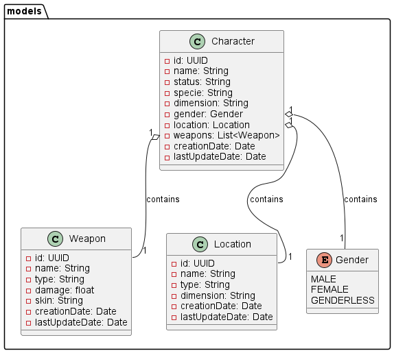

#  Rick and Morty API
This project is a simple API for managing characters and locations from the Rick and Morty universe. It's built using Java 17, Spring Boot, and Maven. The application uses MySQL as its database, and the provided configuration assumes a local MySQL instance.



## Prerequisites
Before running the application, make sure you have the following prerequisites:

* Java 17
* Maven
* MySQL

## API Endpoints
### Characters
Get All Characters
* Endpoint: `GET /api/characters`
* Description: Retrieves a list of all characters.
* Response: Returns a JSON array containing character details.

Get Character by ID
* Endpoint: GET /api/characters/{id}
* Description: Retrieves details of a specific character based on the provided ID.
* Parameters: {id} - The UUID of the character.
* Response: Returns JSON containing details of the specified character.
  
Create Character
* Endpoint: POST /api/characters
* Description: Creates a new character.
* Request Body: JSON representation of the character to be created.
  ```
  {
    "name": "New Character",
    "status": "Alive",
    "location": {
      "id": "6b80a6c1-3b82-4991-85fd-81d704782360",
    },
    "specie": "Human",
    "gender": "FEMALE",
    "dimension": "Dimension C-137"
  }
  ```
* Response: Returns JSON containing details of the created character.

Update Character by ID
* Endpoint: PUT /api/characters/{id}
* Description: Updates details of a specific character based on the provided ID.
* Parameters: {id} - The UUID of the character.
* Request Body: JSON representation of the character
  ```
  {
    "name": "New Character",
    "status": "Alive",
    "location": {
      "id": "6b80a6c1-3b82-4991-85fd-81d704782360",
    },
    "specie": "Human",
    "gender": "MALE",
    "dimension": "Dimension C-137"
  }
  ```
* Response: Returns JSON containing details of the updated character.

Delete Character by ID
* Endpoint: DELETE /api/characters/{id}
* Description: Deletes a specific character based on the provided ID.
* Parameters: {id} - The UUID of the character.
* Response: Returns JSON containing details of the specified deleted character.

  _________________________________
### Locations
Get All Locations
* Endpoint: `GET /api/locations`
* Description: Retrieves a list of all locations.
* Response: Returns a JSON array containing location details.

Get Location by ID
* Endpoint: GET /api/locations/{id}
* Description: Retrieves details of a specific location based on the provided ID.
* Parameters: {id} - The UUID of the location.
* Response: Returns JSON containing details of the specified location.
  
Create Location
* Endpoint: POST /api/locations
* Description: Creates a new location.
* Request Body: JSON representation of the location to be created.
  ```
  {
    "name": "New Location",
    "type": "Type Example",
    "dimension": "Dimension Example"
  }
  ```
* Response: Returns JSON containing details of the created location.

Update Location by ID
* Endpoint: PUT /api/locations/{id}
* Description: Updates details of a specific location based on the provided ID.
* Parameters: {id} - The UUID of the location.
* Request Body: JSON representation of the location
  ```
  {
    "name": "Updated Location",
    "type": "Updated Type",
    "dimension": "Updated Dimension"
  }
  ```
* Response: Returns JSON containing details of the updated location.

Delete Location by ID
* Endpoint: DELETE /api/locations/{id}
* Description: Deletes a specific location based on the provided ID.
* Parameters: {id} - The UUID of the location.
* Response: Returns JSON containing details of the specified deleted location.
